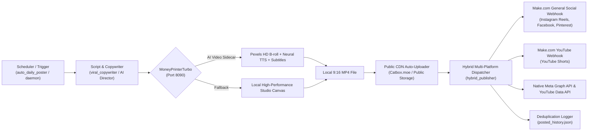

# 🏝️ Carnival Planner - Automated AI Social Video Engine & Multi-Platform Publisher

An autonomous, full-stack AI content engine built for **Carnival Planner** that creates broadcast-quality 9:16 vertical video reels, 2D motion graphics, and viral captions, and auto-publishes across **Instagram Reels**, **YouTube Shorts**, **Facebook**, **TikTok**, and **Pinterest**.

---

## 🛠️ Complete Architecture



---

## 🚀 Key Features

1. **MoneyPrinterTurbo AI Video Sidecar**:
   - Integrates with local FastAPI container on port `8090`.
   - Automatic query of Pexels stock footage and 2D animation clips.
   - Synchronized Azure / Edge TTS voiceovers (`en-US-ChristopherNeural`, `en-US-AvaNeural`).
   - Kinetic, word-by-word subtitles and background Soca music.

2. **2D Animated & Motion Graphics Engine** (`generate_2d_animated_reel.py`):
   - Generates high-energy 2D anime street aesthetics, neon soundwaves, and sound system visuals.
   - Tailored pattern interrupts for high scroll-stopping retention.

3. **VIP Product & Feature Drop Studio** (`generate_product_drop_reel.py`):
   - Generates product showcases, Soca Passport rewards, and squad feature announcements with gold pricing cards and direct checkout links.

4. **Multi-Platform Webhook Dispatcher** (`hybrid_publisher.py`):
   - Automatically uploads local video/graphics to public CDN (`catbox.moe`) with candidate path resolution.
   - Dispatches parallel HTTP payloads to Make.com / Ayrshare webhooks for instant live posting across Instagram, YouTube, TikTok, Facebook, and Pinterest.

5. **24/7 Scheduling Daemon & Zero Duplicate Engine** (`scheduler_daemon.py` / `auto_daily_poster.py`):
   - Schedules 3 posts daily (09:00 AM, 03:00 PM, 09:00 PM).
   - Tracks `posted_history.json` to guarantee no repeated themes or duplicate titles.

---

## 💻 CLI Commands

### 1. Test MoneyPrinter Health Check
```bash
python3 ig_engine/moneyprinter_client.py
```

### 2. Generate and Broadcast 2D Animated Reel
```bash
python3 ig_engine/generate_2d_animated_reel.py
# For dry-run simulation:
python3 ig_engine/generate_2d_animated_reel.py --dry-run
```

### 3. Generate and Broadcast VIP Feature / Drop Reel
```bash
python3 ig_engine/generate_product_drop_reel.py
```

### 4. Run Autonomous Daily Post (Zero-Duplicate Verified)
```bash
python3 ig_engine/auto_daily_poster.py
```

### 5. Launch Background Daemon (3x Daily Scheduler)
```bash
python3 ig_engine/scheduler_daemon.py
```
